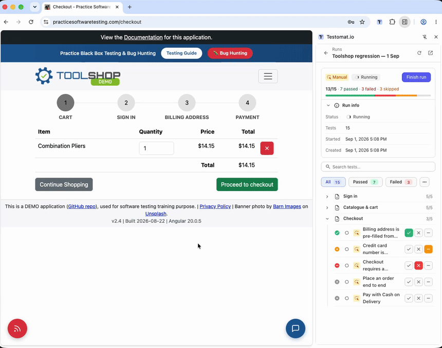

# Testomat.io Chrome extension

Run [Testomat.io](https://testomat.io) manual tests in Chrome's side panel,
next to the site you are testing. Open a run, read the steps, tick them
off, mark passed / failed / skipped with a comment — and attach the evidence
without leaving the tab: an annotated screenshot, a screen recording, the
page's console & network log. New tests can be written in the panel too, or
recorded from your clicks on the page.

Works with `app.testomat.io` and with self-hosted instances. Not in the
Chrome Web Store: you load it from a folder, once.

## Install

1. Download the newest zip from
   [Releases](https://github.com/testomatio/browser-extension/releases) and
   unpack it — or `git clone` this repository.
2. Open `chrome://extensions` and switch on **Developer mode** (top right).
3. Click **Load unpacked** and pick the folder you unpacked — from a clone,
   the **`extension/`** folder inside it, not the repository root.
4. Click the puzzle icon in Chrome's toolbar and pin **Testomat.io**.
5. Click the pinned icon — the panel opens and asks you to connect.

Chrome 123 or newer. Nothing to build. To update, replace the folder's
contents and press reload (↻) on the extension's card — your settings and
unsent results survive it. Details and pictures: [Install and
update](docs/guide/install.md).

## Quick start

1. **Connect.** Press **Open Testomat.io & authorize**, paste the token it
   gives you, press **Connect**, pick your project.
   → [Connect](docs/guide/connect.md)
2. **Open a run.** **Runs** tab → click a run → click a test.
3. **Mark it.** Tick the steps, press **Passed**, **Failed** or **Skipped**
   (with a comment), then **Next test →**. Nothing navigates on its own.
   → [Run a manual run](docs/guide/run-tests.md)
4. **Attach evidence.** In the test's **Attachments** fold: **Attach
   screenshot** opens an annotator over the page, **Attach screen
   recording** records the tab; with **Rec** on, marking a test Failed
   attaches its console & network log by itself.

## Guide

| Page | Covers |
|---|---|
| [Install and update](docs/guide/install.md) | Load the folder, pin the icon, update without losing anything |
| [Connect](docs/guide/connect.md) | Authorize, pick a project, self-hosted instances, basic mode |
| [Run a manual run](docs/guide/run-tests.md) | Runs, steps, statuses, comments, hotkeys, finish, working offline |
| [Attach a screenshot](docs/guide/screenshots.md) | Capture the tab, annotate over the page, full-page shots |
| [Attach a screen recording](docs/guide/screen-recording.md) | Record the tab, review and trim, attach |
| [Console & network log](docs/guide/console-network-log.md) | Rec: the log that lands on a failed result |
| [Create tests](docs/guide/create-tests.md) | Add by title, write in the editor, parameters |
| [Step recorder](docs/guide/step-recorder.md) | Do the flow once, the test writes itself; polish with AI |
| [Settings and shortcuts](docs/guide/settings.md) | Every setting with its default, sign out, keyboard shortcuts |

## Privacy

Nothing runs on a page without your click, and nothing the extension reads
goes anywhere except your own Testomat.io instance. What is stored, what is
sent and when, every permission and why it is needed, and every off switch:
[PRIVACY.md](PRIVACY.md).

## Where to report

Bugs and feature requests go to this repository's
[Issues](https://github.com/testomatio/browser-extension/issues). A useful
report says what you clicked, what happened (with the exact wording of any
message), your Chrome version, and whether the *Basic mode* pill was
showing. Please leave out API tokens and run URLs you would rather keep
private.

## For developers

- [`docs/architecture.md`](docs/architecture.md) — module map, data flows,
  the permission model, storage keys, known traps.
- [`docs/host-handoff.md`](docs/host-handoff.md) — signing the panel in from
  an app that launched the browser (`handoff.json`).

There is no build step: `extension/` runs exactly as it is checked in. The
end-to-end suite lives outside this tree and drives a live Testomat.io
account, so pull requests are verified by maintainers by hand; a few test
seams in the shipped code look unused from here — see architecture §5.3
and leave them alone.

## Licence

MIT — see [LICENSE](LICENSE). Vendored under `extension/vendor/` with their
own licences: [showdown](https://github.com/showdownjs/showdown) (MIT) and
[OverType](https://github.com/panphora/overtype) (MIT); icon paths from
[Material Symbols](https://fonts.google.com/icons) (Apache-2.0); JetBrains
Mono under the SIL Open Font License (`extension/shared/fonts/OFL.txt`).
